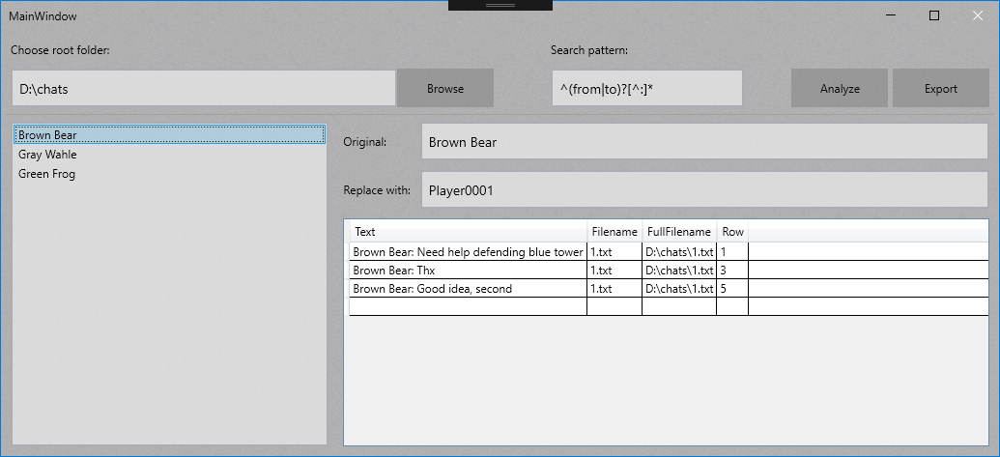

<!--
  Title: Name Anonymizer
  Description: A simple program to anonymize chat logs.
  Author: Jonathan Hasenfuß (jhasenfuss)
-->

# NameAnonymizer

## Overview
This tool is made to anonymize chat histories. The chats are stored in .txt files in the following format:
```
Brown Bear: Need help defending blue tower
Gray Wahle: On my way
Brown Bear: Thx
Green Frog: Please join ts for better communication
Brown Bear: Good idea, second
...
```
The usernames will be replaces with "PlayerXXXX":
```
Player0001: Need help defending blue tower
Player0002: On my way
Player0001: Thx
Player0003: Please join ts for better communication
Player0001: Good idea, second
...
```

And now the chat can be used e.g. as a linguistic corpus for a scientific paper.

## Screenshots


## Technologies
Project is created with:
- [FluentWPF](https://github.com/sourcechord/FluentWPF)
- [Win 10 Theme Switcher](https://engy.us/blog/2018/10/20/dark-theme-in-wpf/)
